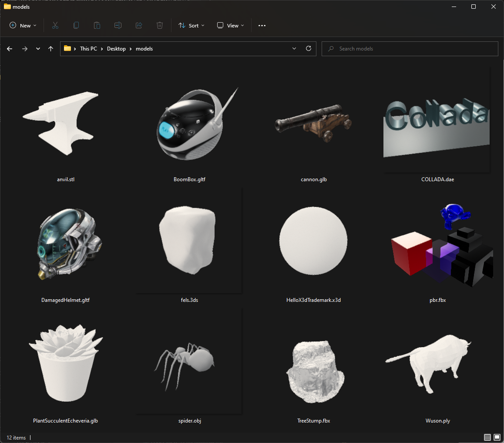

# Space Thumbnails

Generates preview thumbnails for 3D model files. Provide a Windows Explorer extensions that adds preview thumbnails for 3D model files.

## Supported formats

* Wavefront Object (`.obj`)
* FBX-Format, as ASCII and binary (`.fbx`)
* Stereolithography (`.stl`)
* Collada (`.dae`)
* Stanford Polygon Library (`.ply`)
* glTF2.0 (`.glb`/`.glTF`)
* Extensible 3D (`.x3d`/`.x3db`)
* 3D Studio Max 3DS (`.3ds`)

## Windows Explorer Extensions

#### **[Download From Github Release](https://github.com/EYHN/space-thumbnails/releases)**

### No thumbnails showing

**Ensure thumbnails are generally enabled.** Are thumbnails working with other file types on your system, e.g. photos? If not, you may have disabled them altogether.

1. open any folder
2. open the `Folder Options`

    * Windows 10: select `View` → `Options` → `Change folder and search options`

    * Windows 7: select `Organize` → `Folder and search options`

3. Select the `View` tab
4. in `Advanced settings`, make sure the `Always show icons, never thumbnails` option is not checked

**Clear your thumbnail cache.** This forces Explorer to request new thumbnails instead of relying on outdated data.

1. click the `Start` button and type `cleanmgr.exe`
2. select drive `C:` and confirm
3. check `Thumbnails` and confirm
4. reboot

## Links

* [google / filament](https://github.com/google/filament): 3D rendering engine, and [the rust bindings](https://github.com/EYHN/rust-filament)
* [assimp](https://github.com/assimp/assimp): Asset import library, provides support for 3D file formats.

## License

© 2022 [EYHN](https://github.com/EYHN)

Please see [LICENSE](./LICENSE).